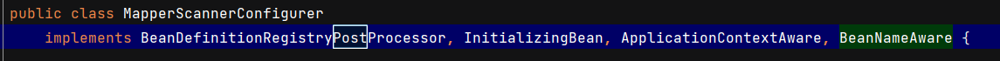
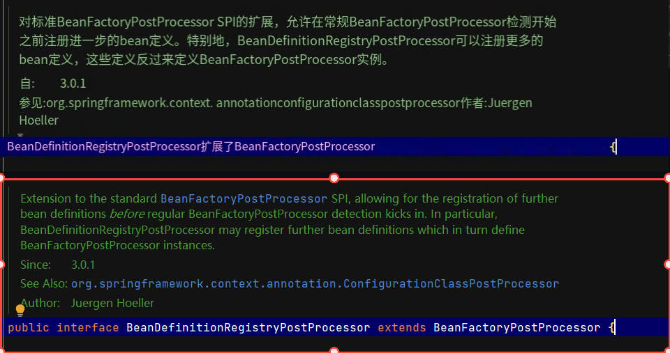
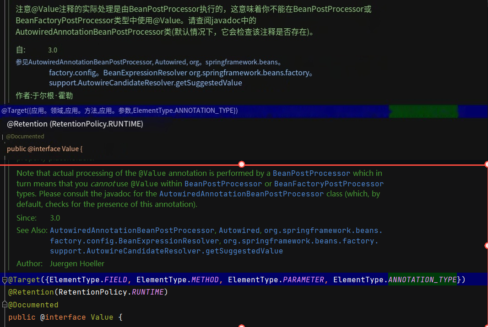
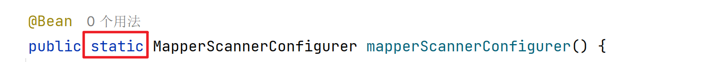

# 笔记

## spring_classwork1

### servlet 中使用 @Autowire 注解，报错空指针异常

2024.3.13 13:00

为什么无法使用？
因为 servlet 类由 servlet 容器管理，和 spring 容器不互通。
所以需要在 servlet 初始化时填充 spring 容器中的 bean。

如果还是需要使用 @Autowire 注解，可以用在初始化时获取本类所有被自动装配的 bean 实例

```java
@Autowired
private XxxService xxxService;

@Override
public void init() throws ServletException {
    WebApplicationContextUtils.getWebApplicationContext(getServletContext())
            .getAutowireCapableBeanFactory().autowireBean(this);
}
```

如果不用 @Autowire 注解，则可以在需要用该 bean 实例时，直接从 spring 容器中拿取

```java
ApplicationContext ac = WebApplicationContextUtils.getRequiredWebApplicationContext(getServletContext());
// 从 spring 容器中获取 service 实例
XxxService xxxService = ac.getBean("xxxService", XxxService.class);
```

### SpringConfig 中装配 MapperScannerConfigurer 导致 @Value 注入失效

2024.3.14 21:21 和 SPRuala 一下午的研究成果

原因：

在经过多次翻译文档、打断点调试之后，得出结论

> 以下类名实在太长，用类 1 类 2 来进行标识
>
> 截的文档图，上半截是翻译，下半截是原文和类名

#### 原因 1：BeanDefinitionRegistryPostProcessor [类 1] 的优先级极高

由于 **MapperScannerConfigurer [类 2]** 实现了 **BeanDefinitionRegistryPostProcessor [类 1]**

（朱：灵感来源是 **BeanDefinitionRegistryPostProcessor [类 1]** ，其他三个类是无效阅读）



而实现了 **BeanDefinitionRegistryPostProcessor [类 1]** 的类会在 **BeanFactoryPostProcessor [类 0]** 检测之前运行（相当于有极高优先级，如图）



所以，**SpringConfig** 中装配 **MapperScannerConfigurer [类 2]** 实例时，==**MapperScannerConfigurer [类 2]** 实例会优先创建==

#### 原因 2：@Value 的局限性

因为 **@Value** 注解由 **BeanPostProcessor** 执行，所以不能在**BeanPostProcessor** 或 **BeanFactoryPostProcessor [类 0]** 类型中使用 **@Value**



同样的，由于**BeanDefinitionRegistryPostProcessor [类 1]** 继承了 **BeanFactoryPostProcessor [类 0]** ，所以 **@Value** 也不能在 **BeanDefinitionRegistryPostProcessor [类 1]** 中使用

而 **BeanFactoryPostProcessor** 实现了 **BeanDefinitionRegistryPostProcessor [类 1]** ，所以 **@Value** 同样不能在 **MapperScannerConfigurer [类 2]** 中使用

此时，由于 **MapperScannerConfigurer [类 2]** 实例已经优先创建，**@Value** 也就失效了

#### 解决方法

1. 在 Bean 注入的方法前加上 static 修饰

    

    - 原理：有了 static 之后，这个方法在类文件加载到内存之后就可以直接调用（调用时不会触发类的构造函数等），也就是说已经脱离了当前类，也就不会影响到当前类中的 @Value 注解了

2. 将这个注入的方法移动到其他没有 @Value 注解的类中，然后用 @Import 注解导入到 SpringConfig 类中

#### 加载的优先级顺序

例：

1. 实现了 BeanDefinitionRegistryPostProcessor [类 1] 的 bean （只能在调试中运行，真写了就跑不动了）
2. 有 static 版本的 MapperScannerConfigurer [类 2] （正常情况下的优先级最高）
3. 继承了 BeanFactoryPostProcessor [类 0] 的 bean（只能在调试中运行，真写了就跑不动了）
4. SpringConfig
5. 无 static 版本的 MapperScannerConfigurer [类 2]
6. 配置文件加载类 `PropertySourcesPropertyResolver` （加载了无 static 版本的 MapperScannerConfigurer [类 2] 就会跳过该操作）
7. SpringConfig 中的 其他 Bean

## spring_work1

### @RequestBody 注解无法解析对象中首字母小写，第二个字母大写的属性（Jackson 的原因）

2024-4-16 22:00

例如属性为 eName

当 get/set 方法名称为 getEName/setEName 的时候，会因为 Jackson 在处理完 getEName/setEName 后无法找到对应的属性

Lombok 也是，由于 Lombok 生成的 get/set 方法的语义规范与 Jackson 处理 get/set 方法不一致，所以会导致的属性名无法匹配。

以下流程参考： <https://zhuanlan.zhihu.com/p/628668559> （写得很详细）

Jackson 的处理流程：

-   首先会根据 `offset`字段去除前面的三个字母，一般为 get 或 set
-   去除前面三个字母 `set` 后，发现第一个字母 `E` 是大写的，因此将第一个字母小写成 `e`，然后接着往后找，如果后面的还是大写，接着变小写...直到找到了一个本来就是小写的字母后，才将后面所有的字母一股脑添加进来。

由于 `setEName` 在去除前面的 set 后，前面两个字母都是大写，因此在这种处理逻辑下，最后得到的属性名为 `ename`。

换句话说，如果 set 方法的名称是 `seteName` ，那么处理后得到的就是正确的 `eName`。

所以解决方案：

1. 使用 Lombok 的配置来解决。在项目根目录下创建 `lombok.config`文件，并添加配置项`lombok.accessors.capitalization = beanspec`即可
2. 改 get/set 的方法名
3. 利用 Jackson 的 JsonProperty 注解强行指定属性名（推荐在get方法上标注）

但由于 Lombok 和 ptg 插件都只能生成属性名首字母大写的 get/set 方法，如果实在懒得自己写，可以用 `@JsonProperty` 来标注该属性在 JSON 中的名称

但是：使用 @JsonProperty 注解标注属性，序列化时会多出一个字段（参考 ”[使用 @JsonProperty 注解标注属性导致序列化时多出一个字段的原因](#使用 @JsonProperty 注解标注属性导致序列化时多出一个字段的原因)“ 的内容）

> 先说结论，只需要满足以下两个条件之一即可解决序列化和反序列化的问题
>
> - 在 get 方法上标注 @JsonGetter("name") 或者 @JsonProperty("name")  ————推荐在 get 方法上标注 @JsonProperty
> - 在 set 方法上标注 @JsonSetter("name") 或者 @JsonProperty("name") 

### 使用 @JsonProperty 注解标注属性导致序列化时多出一个字段的原因

2024-4-17

思路参考 <https://blog.csdn.net/shuair/article/details/121234146> 

> 在我的多次测试之下发现，Jackson 的默认序列化会调用该类的所有 get 方法，从而多出标注了 get 的字段

而 @JsonProperty 标注到首字母大写的属性上时，从序列化结果上来说会使属性多出一个首字母到第二个小写字母之间的字母都小写的字段，相当于直接多了个对应的 get 方法

#### 对 Jackson 注解的源码进行追溯（可以跳过）

会先到 com.fasterxml.jackson.databind.introspect 包下的 JacksonAnnotationIntrospector 类

- 在 com.fasterxml.jackson.databind.ser.BeanSerializerFactory 的 createSerializer 方法中创建序列化程序
- 在 JacksonAnnotationIntrospector 类中
  - 对于在类中找到的 **get 方法**，执行 findNameForSerialization 方法查找要**序列化**的名称，在这个方法中会扫描在序列化的类中标注了 `@JsonGetter` 和 `@JsonProperty` 的属性和方法
  - 对于在类中找到的 **set 方法**，执行 findNameForDeserialization 方法查找**反序列化**的名称，在这个方法中会扫描在序列化的类中标注了 `@JsonSetter` 和 `@JsonProperty` 注解的属性和方法
- 之后到 DefaultAccessorNamingStrategy 类的 legacyManglePropertyName 方法，根据 get/set 方法的方法名拿到字段属性

所以，属性上标注了 @JsonProperty 之后会在序列化时多出一个字段，因为属性被 @JsonProperty 重新定义了拿到的字段名，而代码中的get方法还在，于是在扫描到 get 方法的时候，会发现没有重复的字段（因为被 @JsonProperty 重命名了），于是直接变成序列化的新字段，但值和标志了 @JsonProperty 的属性是一样的（毕竟 get 方法返回的就是这个属性的值）

#### 官方文档的说明与测试结果（只看这个）

<https://github.com/FasterXML/jackson-databind?tab=readme-ov-file#annotations-changing-property-names>

官方文档的实例

```java
public class MyBean {
   private String _name;

   // without annotation, we'd get "theName", but we want "name":
   @JsonProperty("name")
   public String getTheName() { return _name; }

   // note: it is enough to add annotation on just getter OR setter;
   // so we can omit it here
   public void setTheName(String n) { _name = n; }
}
```

@JsonProperty、@JsonGetter、@JsonSetter 源码中的第一行文档注释：

注：详细注释请看源码

@JsonProperty

```java
Marker annotation that can be used to define a non-static method as a "setter" or "getter" for a logical property (depending on its signature), or non-static object field to be used (serialized, deserialized) as a logical property.
—————————————
翻译：标记注解，可用于将非静态方法定义为逻辑属性（取决于其签名）的“setter”或“getter”，或将要用作（序列化、反序列化）逻辑属性的非静态对象字段。
```

@JsonGetter

```java
Marker annotation that can be used to define a non-static, no-argument value-returning (non-void) method to be used as a "getter" for a logical property. It can be used as an alternative to more general JsonProperty annotation (which is the recommended choice in general case).
—————————————
标记注解，可用于定义一个非静态、无参数值返回（非void）方法，用作逻辑属性的“getter”。它可以作为更通用的JsonProperty注释（在一般情况下是推荐的选择）的替代方案。
```

@JsonSetter

```java
Annotation that can be used to define a non-static, single-argument method to be used as a "setter" for a logical property as an alternative to recommended JsonProperty annotation; or (as of 2.9 and later), specify additional aspects of the assigning property a value during serialization.
—————————————
可用于定义非静态单参数方法的注释，该方法将用作逻辑属性的“setter”，作为推荐JsonProperty注释的替代方法；或者（从2.9及更高版本开始），指定在序列化期间为属性赋值的其他方面。
```

大概的意思是，==只需要将 @JsonProperty 注解放到 get 方法上就行==

> 在实际测试中发现，只需要满足以下两个条件之一，该字段无论是序列化还是反序列化都不会出现问题（至少在简单类上是这样）
>
> - 在 get 方法上标注 @JsonGetter("name") 或者 @JsonProperty("name") ————推荐在 get 方法上标注 @JsonProperty
> - 在 set 方法上标注 @JsonSetter("name") 或者 @JsonProperty("name") 

测试代码：

```java
static class C1 {
    // @JsonProperty("cId") // 序列化时会多一个字段
    // @JsonGetter("cId") // 无法在属性上标注
    // @JsonSetter("cId") // 反序列化中有效，序列化不生效
    private String cId;

    public C1() {
    }

    public C1(String cId) {
        this.cId = cId;
    }

    @JsonProperty("cId")
    // @JsonGetter("cId")
    public String getCId() {
        return cId;
    }

    // @JsonProperty("cId")
    // @JsonSetter("cId")
    public void setCId(String cId) {
        this.cId = cId;
    }

    public String toString() {
        return "C1{cId = " + cId + "}";
    }
}

@Test
public void testC1() throws JsonProcessingException {
    ObjectMapper objectMapper = new ObjectMapper();

    C1 c1 = new C1("12345");
    String s = objectMapper.writeValueAsString(c1);
    System.out.println("对象转json = " + s);

    String json = "{\"cId\":\"12\"}";
    C1 readValue = objectMapper.readValue(json, C1.class);
    System.out.println("json转对象 = " + readValue);
}
```


